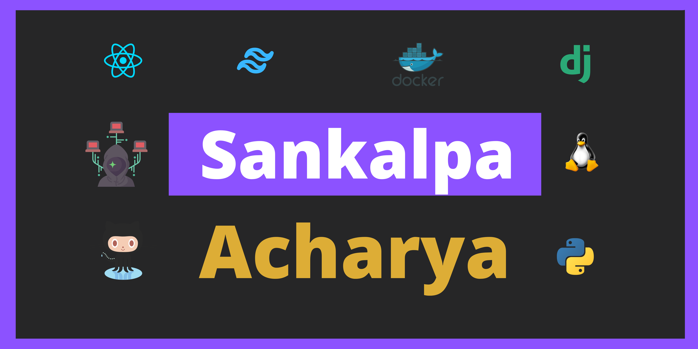

<h1>Hi 👋</h1>

  

 

<h2 align="center">A Passionate Full Stack Developer and Cyber Security Enthusiast </h2>

Undergraduate Computer Science and Engineering Student with Experience in Full Stack Web Development 🌏 and Web Application Penetration Testing 🐱‍💻. Passionate about DevSecOps 🐳👨🏻‍💻, and Web Development🕸️.

 

<h2>Checkout some of my projects</h2>

<h2>GitHub Stats ⭐️</h2>

 

<h3 align="left">Languages and Tools:</h3>
    
    
    
    
    
    
    
    
    
    

 
<h3 align="left">Connect with me:</h3>

